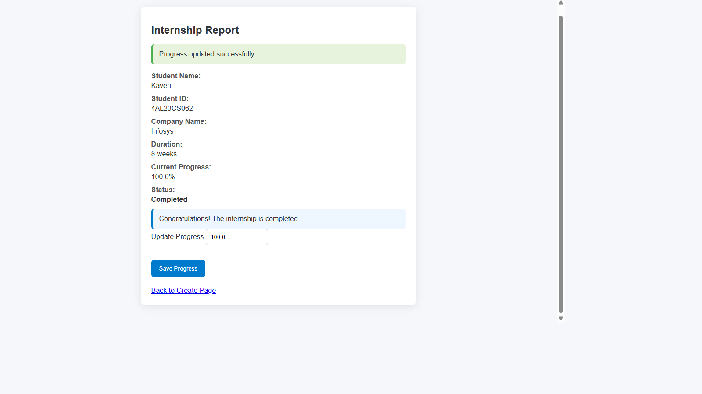

<<<<<<< HEAD
# Internship Tracking System (Java)

##  Description
A simple Java-based application to manage and track student internship details.

##  Features
- Store student internship details
- Update internship progress
- Check completion status
- Display internship report

##  Technologies Used
- Java
- OOP Concepts (Classes, Objects, Encapsulation)

##  How to Run
1. Compile:
   javac InternshipTrackingSystem.java

2. Run:
   java InternshipTrackingSystem

##  Web Interface
This project now includes a JSP-based web interface under `WebContent` and a servlet-backed model under `src`.

### Maven Build
The project uses Maven to build a WAR package.

1. Run the build with the Maven Wrapper:
   ```bash
   ./mvnw clean package
   ```
   On Windows, use:
   ```bat
   mvnw.cmd clean package
   ```

2. The WAR file is generated under `target/internship-tracking-system.war`.

3. Deploy the generated WAR to a servlet container such as Apache Tomcat.

### Alternate Local Build
If you need direct compilation without Maven, use a servlet API JAR on the classpath:

```bash
javac -cp path/to/servlet-api.jar -d WebContent/WEB-INF/classes src/com/internship/model/Internship.java src/com/internship/servlet/InternshipServlet.java
```

### Tomcat Deployment
- Copy the generated WAR into Tomcat's `webapps` directory.
- Start Tomcat and open `http://localhost:8080/<app-name>/`.

3. Use the web pages:
   - `index.jsp` to create a new internship record
   - `report.jsp` to update progress and view completion status

##  Sample Input
Student Name: Kaveri  
Student ID: 4AL23CS062  
Company: Infosys  
Duration: 8 weeks  

## Output


##  Author
Kaveri
